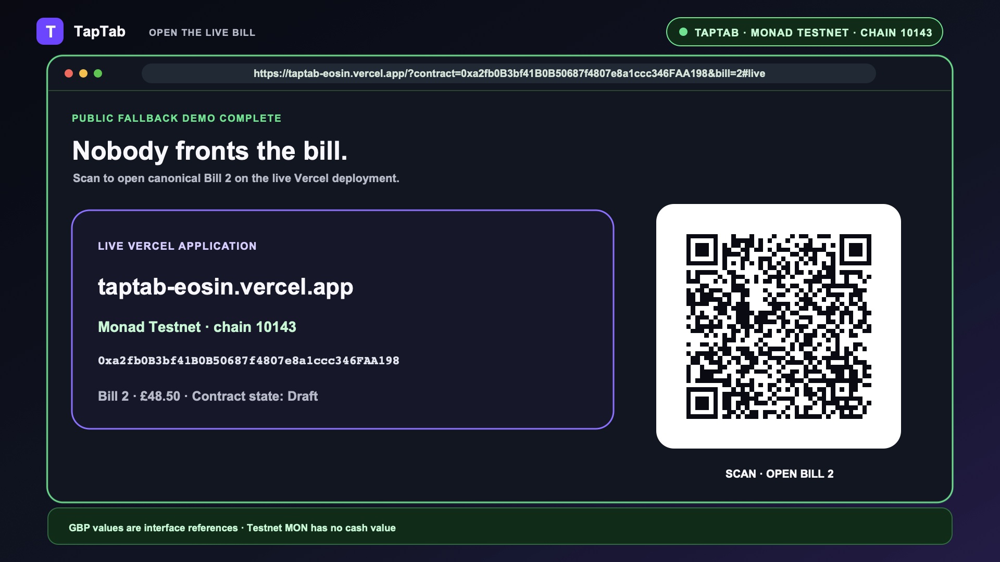
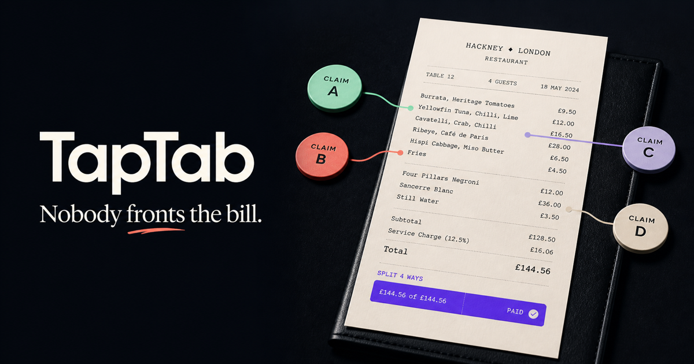
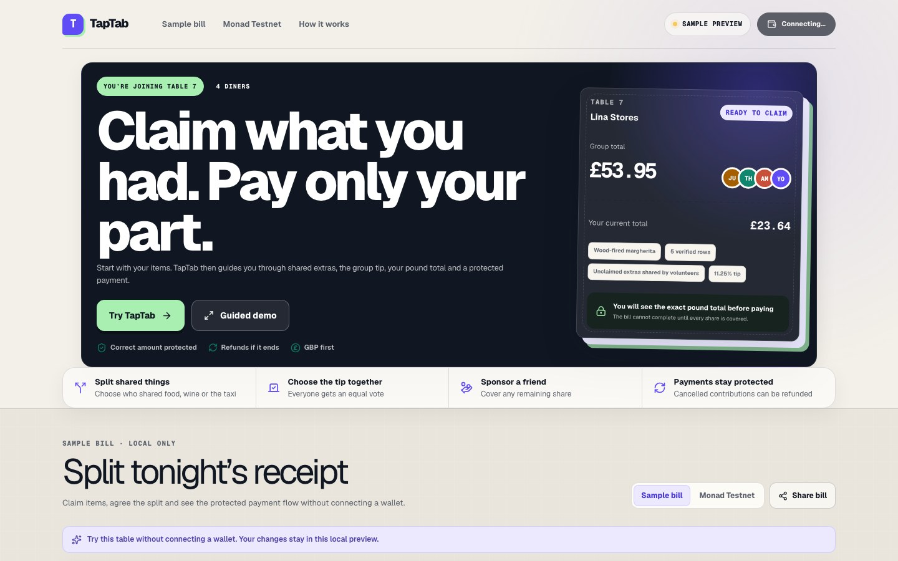
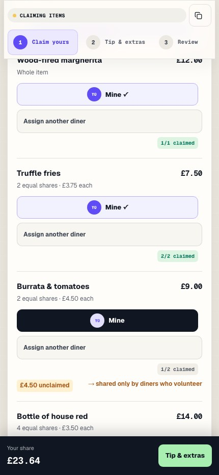
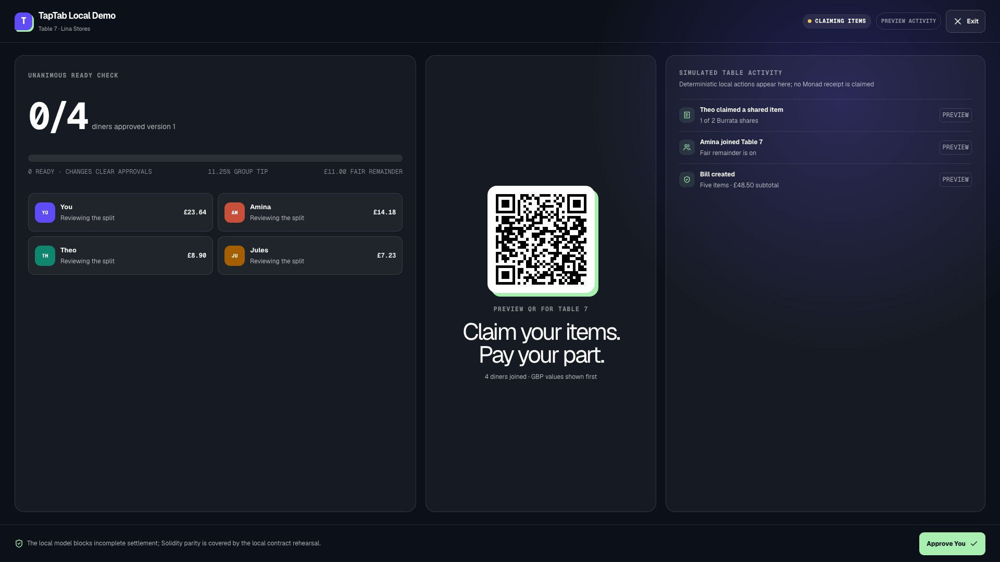

# TapTab — Nobody fronts the bill

## Description

TapTab is a GBP-first shared-bill application for groups dining out together.
Diners claim whole or shared receipt items, agree a group tip, fund only their
allocation and settle through a smart contract on Monad Testnet. It removes the
usual need for one person to pay the entire bill and chase everyone afterwards.

The equal split lands differently around the table. Short silent highlight
from *Friends*, “Five Steaks and an Eggplant”. [Open the original
clip](https://www.youtube.com/watch?v=EYb9jnt2cv4).

The application is designed for diners, bill organisers and venues. It includes
a fully local sample experience for demonstrations and a contract-backed live
workspace when a trusted TapTab deployment and wallet provider are configured.
The repository retains some legacy CrowdCart files; TapTab is the active product.

**Public Monad Testnet application:**
[open canonical live bill 2](https://taptab-eosin.vercel.app/?contract=0xa2fb0B3bf41B0B50687f4807e8a1ccc346FAA198&bill=2#live).
The configured deployment is contract
[`0xa2fb…A198`](https://testnet.monadscan.com/address/0xa2fb0B3bf41B0B50687f4807e8a1ccc346FAA198)
on chain `10143`; the public
[readiness check](https://taptab-eosin.vercel.app/api/health/ready)
validates its bytecode and canonical bill `2`.

The current Vercel production deployment is `dpl_H4rRMxPLEBN3tg12Kp3sbxQxS9Sx`.
Its root route, readiness route and canonical bill were rechecked on 8 August
2026; the retained result is in
[the Vercel deployment evidence](docs/submission/VERCEL_DEPLOYMENT_EVIDENCE.md).
The older Cloudflare Worker remains historical evidence for source checkpoint
`27ecdb4`; it is no longer the canonical judge URL.

> [!WARNING]
> TapTab is unaudited hackathon software. Use it only with Testnet funds. The
> contract is deployed, MonadVision reports a perfect Sourcify match, and the
> contract has completed both multi-wallet settlement and contributor-refund
> rehearsals on Monad Testnet. This is
> evidence of Testnet behaviour, not a production security review.
> Testnet MON has no monetary value; the GBP/USD display is a mainnet MON
> reference, not a redemption promise.

> [!IMPORTANT]
> The official Monad Blitz
> [rules](https://monad-foundation.notion.site/Rules-Guidelines-IMPORTANT-PLEASE-READ-73b6367594f2833e952901112ad5c959?pvs=25)
> require a fresh event-day project, no more than four team members, a public
> repository and an operational Monad Testnet deployment. The official
> [submission process](https://monad-foundation.notion.site/Submission-Process-cc66367594f2837c898701aabd948402?pvs=25)
> requires a public fork of the organiser repository. This implementation
> existed before the stated event date. Obtain written organiser guidance before
> treating it as an eligible submission, and do not describe pre-event work as
> event-day development.

The concise judging bundle is in
[docs/submission/README.md](docs/submission/README.md). It includes the pitch,
architecture diagram, maintained captures, narrated 2 minute 30 second demo, short
captioned cut and local evidence manifest.

## Table of Contents

- [Submission Bundle](#submission-bundle)
- [Demonstration Production Record](#demonstration-production-record)
- [Features](#features)
- [Tech Stack](#tech-stack)
- [Architecture Overview](#architecture-overview)
- [Installation](#installation)
- [Local Judging Runbook](#local-judging-runbook)
- [Usage](#usage)
- [Configuration](#configuration)
- [Screenshots / Demo](#screenshots--demo)
- [API / CLI Reference](#api--cli-reference)
- [Tests](#tests)
- [Roadmap](#roadmap)
- [Contributing](#contributing)
- [License](#license)
- [Contact / Support](#contact--support)

## Submission Bundle

Use [docs/submission/README.md](docs/submission/README.md) as the submission
entry point. It keeps local proof, public Testnet deployment and multi-wallet
evidence, and the remaining submission gaps separate.

## Demonstration production record

The current fallback demonstration is exactly `150.000` seconds at 1920 × 1080
and 30 fps. It uses ElevenLabs' synthetic **Nora — Blackpool Product Guide**
voice at natural speed, burnt-in captions, an original music bed and a
speech-free evidence hold. The complete application views remain visible
without magnified crops. Purple identifies the deterministic local sample;
green identifies verified public Monad Testnet reads; amber identifies the
protected cancellation/refund branch.

The film proves the Vercel deployment can read chain `10143`, the trusted
contract and canonical Bill `2`. It then displays the genuine historical Bill
`3` settlement receipt with `Success`, explicitly labelled as a replay with no
new wallet write. The final QR opens live Bill `2`, which is publicly readable
and remains `Draft`; Testnet MON is disclosed as having no cash value.

### Retained video sources and records

| File | Purpose |
| --- | --- |
| [Current 2:30 MP4](docs/submission/video/2min30/taptab-demo-2min30.mp4) | Playable Vercel and Monad Testnet fallback demonstration |
| [Current poster and QR](docs/submission/video/2min30/taptab-demo-2min30-poster.png) | Final Bill 2 call-to-action frame |
| [Current captions](docs/submission/video/2min30/taptab-demo-2min30.srt) | Exact delivered subtitle sidecar |
| [Current narration record](docs/submission/video/2min30/FINAL_NARRATION.md) | Delivered Nora cues and speech-free evidence hold |
| [Current QA](docs/submission/video/2min30/QA_SUMMARY.md) | Duration, codec, audio, QR, decode and evidence checks |
| [Upload-ready captions](docs/submission/video/2min/taptab-demo-2min.srt) | Exact 31-cue UTF-8 subtitle track |
| [V5 production record](docs/submission/video/2min/v5/V5_PRODUCTION_PLAN.md) | Frame-aligned edit decisions and evidence boundaries |
| [V5 build script](docs/submission/video/2min/v5/build-v5.mjs) | Master, poster, teaser, evidence-cut and QA pipeline |
| [Continuous-capture script](docs/submission/video/2min/v5/capture-continuous.mjs) | Records the single-take public-sample interaction |
| [Continuous-capture manifest](docs/submission/video/2min/v5/capture/continuous-capture-manifest.json) | Action timings and original-stream provenance |
| [Final synchronisation audit](docs/submission/video/2min/v5/review/FINAL_SYNC_AUDIT.md) | Review of narration-to-screen alignment |
| [Narration and audio provenance](docs/submission/video/2min/v3/audio/PROVENANCE.md) | Voice, music and effects sources |

The historical V5 build script expects archived raw audio, screen captures and explorer
evidence that are not included in this source-only clone. The historical output
hashes and delivery checks remain documented in
[the video production record](docs/submission/video/README.md); they are not a
claim that the corresponding binaries are downloadable from this repository.

### Submission and evidence files

| File | Contents |
| --- | --- |
| [Submission guide](docs/submission/README.md) | Canonical submission entry point and current release status |
| [Pitch](docs/submission/PITCH.md) | Problem, product, Monad fit and evidence-backed demo script |
| [Architecture](docs/submission/ARCHITECTURE.md) | Application, wallet, RPC and contract boundaries |
| [Three-minute judging runbook](docs/judging/LOCAL_RUNBOOK.md) | Fixed local demonstration sequence and evidence guidance |
| [Markdown task completion record](docs/MARKDOWN_TASK_COMPLETION.md) | Consolidated completion and verification record |
| [Video documentation](docs/submission/video/README.md) | Video inventory, provenance and release notes |
| [Submission evidence manifest](docs/submission/evidence-manifest.json) | Checksummed source, deployment, video and remaining-action record |
| [Source-verification status](docs/submission/SOURCE_VERIFICATION_STATUS.md) | Published Monadscan source and Sourcify full-match evidence |
| [Public preview evidence](docs/submission/public-preview-evidence.json) | Worker deployment, health, browser and public-route checks |
| [Monad Testnet deployment evidence](docs/submission/monad-testnet-deployment-evidence.json) | Contract, Bill 2 creation and public-readiness record |
| [Multi-wallet lifecycle evidence](docs/submission/monad-testnet-multiwallet-evidence.json) | Bills 3 and 4 settlement, cancellation and refund transactions |
| [Web dependency security boundary](SECURITY.md) | Runtime/development audit split and controlled Vinext upgrade gate |
| [Contract toolchain security boundary](contracts/SECURITY.md) | Runtime/development dependency split and controlled Hardhat-upgrade gate |

## Features

- GBP-first receipt and payment presentation, with clearly labelled MON values.
- Browser-based JPEG, PNG and WebP receipt OCR followed by mandatory human review.
- Whole-item and exact share-slot claims for shared dishes, drinks and taxis.
- Group tip voting with a contract-selected median result.
- Fair-remainder allocation limited to participants who explicitly opt in.
- Unanimous split approval before funding can open.
- Version-stamped digest memoisation for low-cost later approvals without
  weakening canonical split verification.
- Claim transfer and departure while the bill is still in its draft phase.
- Exact participant funding and sponsorship of another diner’s remaining share.
- Contract-enforced prevention of overfunding and incomplete settlement.
- Pull-payment proceeds and refunds, including cancellation and expiry paths.
- Personalised payment links that bind the trusted contract, bill and beneficiary.
- Local-only optional diner names scoped to contract, bill and wallet.
- Stage mode for projector-friendly joining, claiming and transaction progress.
- JSON settlement export and public recovery packs.
- Local-only judge evidence with recalculated conservation and settlement checks.
- Wallet preflight checks, call simulation, gas estimation and balance validation.
- Block-pinned Multicall snapshots, chain-time expiry decisions and inactive-tab
  polling suspension.
- Installable PWA behaviour with deliberately restricted service-worker caching.

## Tech Stack

| Area | Technology |
| --- | --- |
| Web application | Next.js 16, React 19 and TypeScript 5 |
| Build and hosting runtime | Next.js on Vercel; Vinext, Vite, Cloudflare Workers and Wrangler retained as an alternative target |
| Styling | Tailwind CSS 4 plus application CSS |
| Wallet integration | Reown AppKit with its Ethers adapter; viem for typed contract reads and writes |
| Blockchain | Monad Testnet, chain ID 10143 |
| Smart contracts | Solidity 0.8.24, Hardhat 2 and ethers 6 |
| Receipt recognition | Tesseract.js in the browser |
| Price reference | CoinGecko Simple Price API with Coinbase exchange-rate fallback |
| QR and icons | qrcode.react and Lucide React |
| Testing | Node.js test runner, Hardhat, Mocha and Chai |
| Local persistence | Browser localStorage; no application database |

## Architecture Overview

~~~mermaid
flowchart LR
  User[Diner or host] --> Web[TapTab web application]
  Web --> Store[(Browser localStorage)]
  Web --> OCR[Tesseract.js worker]
  Web --> Price[GET /api/mon-price]
  Price --> Sources[CoinGecko primary Coinbase exchange-rate fallback]
  Web --> AppKit[Reown AppKit]
  AppKit --> Wallet[User wallet]
  Wallet --> RPC[Monad Testnet RPC]
  Web --> RPC
  RPC --> Contract[TapTab.sol]
  Contract --> Chain[(Monad Testnet state)]
~~~

The Next.js application owns the interface, local preview and validation logic.
Its server route supplies a cached mainnet MON price reference, while Reown and
viem connect the user’s wallet to the TapTab contract on Monad Testnet. There is
no central application database: public bill state lives onchain and optional
display names remain in the user’s browser.

## Installation

### Requirements

- Node.js 22.13 or later.
- npm, supplied with Node.js.
- A modern browser.
- Optional for live mode: a Reown project ID, funded Monad Testnet wallet and
  deployed TapTab contract.

### Clone and install

~~~sh
git clone https://github.com/MasteraSnackin/taptab.git
cd taptab
npm ci
~~~

Install the independent contract workspace when contract development or
deployment is required:

~~~sh
cd contracts
npm ci
cd ..
~~~

### Start locally

~~~sh
npm run dev
~~~

Open [http://localhost:3000](http://localhost:3000). The sample bill works
without environment variables or a wallet.

## Local Judging Runbook

Run the complete local gate without contacting Monad Testnet:

~~~sh
npx playwright install chromium
npm run verify:local
~~~

This builds and tests the application, checks lint and types, runs the
multi-viewport Playwright sample checks and Hardhat contract suite, rehearses
settlement, cancellation, expiry and independent refunds, then checks selected
maximum-shape gas ceilings. Both contract scripts are pinned to ephemeral
Hardhat chain <code>31337</code>. They write clearly labelled reports to
<code>outputs/taptab-local-rehearsal.json</code> and
<code>outputs/taptab-gas-benchmark.json</code>.

Use [the local judging runbook](docs/judging/LOCAL_RUNBOOK.md) for the exact
three-minute sequence and evidence boundaries. The generated reports and browser
sample are not Monad Testnet proof.

### Build and run the production bundle

~~~sh
npm run build
npm run start
~~~

## Usage

### Explore the local sample

1. Open the homepage and choose the sample workspace.
2. Review the receipt or use the receipt-import editor.
3. Join as a sample diner and claim whole or shared item slots.
4. Choose whether to accept fair remainder and submit a tip vote.
5. Approve the split, open funding and fund or sponsor an allocation.
6. Open stage mode to present the bill’s progress.
7. Complete settlement or exercise the cancellation, expiry and refund paths.

Sample actions are local simulations. The interface labels them as previews and
does not present them as confirmed Monad transactions.

### Use a live Monad Testnet bill

1. Configure the public frontend variables described below.
2. Start or publish the application over its registered HTTPS origin.
3. Open the Monad Testnet workspace.
4. Connect a wallet and switch to Monad Testnet when prompted.
5. Create a bill or open a trusted bill link.
6. Invite participants, collect claims and obtain unanimous approval.
7. Open funding, collect exact contributions and settle the bill.
8. Retain the explorer links and settlement export as demonstration evidence.

A live bill can be selected with a trusted contract and positive bill ID:

~~~text
https://taptab.mythicmindlabs.workers.dev/?contract=0xa2fb0B3bf41B0B50687f4807e8a1ccc346FAA198&bill=2#live
~~~

Shared links cannot replace the contract address built into the application.

The canonical scaled demo is bill `2`, with deadline
`2026-08-14T17:01:55Z`. Its public chain evidence, together with the original
deployment seed, is:

- [contract deployment transaction](https://testnet.monadscan.com/tx/0xc48ab94b9e503d09f52e32dd8b2f97adb9b0ca80ab83a6a544dc72fa338ba488),
  confirmed in block `51718885`;
- [initial bill `1` creation transaction](https://testnet.monadscan.com/tx/0xf9de7427fd11bdee1d0785c965b7258144f9106ece70d9dfac3b0dcdc943ee41),
  confirmed in block `51718888` as the deployment-time seed;
- [canonical bill `2` creation transaction](https://testnet.monadscan.com/tx/0xc089eb042dc78fb64a0ddf60ea35c5ecbe7f01ff5371b37be9a72bc872effd70),
  confirmed with status `1` in block `51722744` using `1,612,923` gas; and
- [contract on MonadVision](https://testnet.monadvision.com/address/0xa2fb0B3bf41B0B50687f4807e8a1ccc346FAA198),
  where MonadVision reports a perfect Sourcify match for the submitted source.

[The exact verification record](docs/submission/SOURCE_VERIFICATION_STATUS.md)
records the published Monadscan source and the independent Sourcify full match.

Bill `2` locks the genuine CoinGecko quote `0.01536012 GBP/MON`. The £48.50
receipt corresponds to `3157.527415150402471 MON` at that mainnet reference,
then applies an explicit `1,000:1` faucet-funded Testnet settlement scale to an
onchain subtotal of `3.157527415150402471 Testnet MON`. Testnet MON has no
monetary value; this scaling is demo liquidity policy, not a second market quote.

The separate
[multi-wallet evidence record](docs/submission/monad-testnet-multiwallet-evidence.json)
adds a complete public Testnet rehearsal. Bill `3` used three participant
wallets for claims, unanimous approval, exact funding, settlement and creator
withdrawal. Bill `4` used two contributor wallets for cancellation and
independent refunds. The record contains 31 successful contract transactions
and separately discloses one reverted first funding attempt before its
successful bounded-gas retry.

### Deploy the TapTab contract

~~~sh
cp contracts/.env.example contracts/.env
cd contracts
# Add a funded Testnet DEPLOYER_PRIVATE_KEY to .env.
npm run deploy:taptab
~~~

The deployment script refuses networks other than Monad Testnet chain <code>10143</code>.
It deploys the contract, creates a seeded bill and prints the frontend address
and bill ID. Never commit or share the private key or seed phrase.

## Configuration

Copy the frontend template:

~~~sh
cp .env.example .env.local
~~~

### Application variables

| Variable | Required | Purpose |
| --- | --- | --- |
| <code>NEXT_PUBLIC_SITE_URL</code> | Live wallet build | Exact public HTTPS origin registered with Reown. |
| <code>NEXT_PUBLIC_REOWN_PROJECT_ID</code> | Wallet connections | Public project identifier from the Reown dashboard. |
| <code>NEXT_PUBLIC_TAPTAB_ADDRESS</code> | Live TapTab mode | Non-zero address of the trusted TapTab deployment. |
| <code>NEXT_PUBLIC_TAPTAB_BILL_ID</code> | Live TapTab mode | Positive default bill ID; set it together with <code>NEXT_PUBLIC_TAPTAB_ADDRESS</code>. |
| <code>MONAD_TESTNET_RPC_URL</code> | No | Server-only RPC used by the readiness endpoint; defaults to the canonical Monad Testnet RPC. |
| <code>MONAD_TESTNET_FALLBACK_RPC_URL</code> | No | Optional credential-free HTTPS fallback used only when the primary readiness RPC has an eligible availability or read failure. |
| <code>NEXT_PUBLIC_MONAD_TESTNET_FALLBACK_RPC_URL</code> | No | Optional credential-free HTTPS fallback for browser reads and simulations; wallet writes never use it. |

The application keeps wallet connections disabled when the required public
settings are missing. Values prefixed with <code>NEXT_PUBLIC_</code> are visible to
browser users and must never contain secrets.
The TapTab address and bill ID must either both be blank for preview mode or
both be valid for live mode; the shipped template leaves both blank.
The server RPC variables are private runtime configuration and must not be
renamed with a <code>NEXT_PUBLIC_</code> prefix. The browser fallback is public by
design, so it must contain no credentials or secret query material. Both
fallbacks reject non-HTTPS URLs, credentials and fragments. Primary endpoints
are always attempted first, and a fallback cannot turn an authoritative
missing-contract or invalid-bill result into readiness.

The current public release pins
<code>NEXT_PUBLIC_TAPTAB_ADDRESS=0xa2fb0B3bf41B0B50687f4807e8a1ccc346FAA198</code>
and <code>NEXT_PUBLIC_TAPTAB_BILL_ID=2</code>. A query string may select another
bill on that contract, but it cannot replace the build-trusted contract address.

### Contract variables

Create <code>contracts/.env</code> from <code>contracts/.env.example</code>.

| Variable | Required | Purpose |
| --- | --- | --- |
| <code>MONAD_TESTNET_RPC_URL</code> | No | RPC endpoint; defaults to the canonical Monad Testnet RPC. |
| <code>DEPLOYER_PRIVATE_KEY</code> | Deployment | Private key of a funded Testnet deployer. |
| <code>ETHERSCAN_API_KEY</code> | Source verification | Explorer verification credential. |
| <code>TAPTAB_GBP_PER_MON</code> | No | Positive manual quote for deterministic seeded deployment. |
| <code>TAPTAB_PAYEE_ADDRESS</code> | No | Bill payee; defaults to the deployer. |
| <code>TAPTAB_DURATION_SECONDS</code> | No | Bill duration from 300 to 604,800 seconds. |
| <code>TAPTAB_CONTRACT_ADDRESS</code> | Post-deployment check | Address read by <code>check:taptab</code>. |
| <code>TAPTAB_BILL_ID</code> | Post-deployment check | Positive bill ID read by <code>check:taptab</code>. |

The root <code>.env.local</code> and <code>contracts/.env</code> files are ignored by Git.

## Screenshots / Demo

### Desktop overview

### Mobile bill journey

### Stage Mode

- **Local demo:** run <code>npm run dev</code>, then open
  [http://localhost:3000](http://localhost:3000).
- **Public Monad Testnet application:**
  [open canonical bill `2`](https://taptab.mythicmindlabs.workers.dev/?contract=0xa2fb0B3bf41B0B50687f4807e8a1ccc346FAA198&bill=2#live).
  The [readiness endpoint](https://taptab.mythicmindlabs.workers.dev/api/health/ready)
  passes against chain `10143`, the deployed bytecode and bill `2`.
- **Local judge sequence:** follow
  [docs/judging/LOCAL_RUNBOOK.md](docs/judging/LOCAL_RUNBOOK.md), open the
  presenter disclosure and choose **Download local evidence**.
- **Draft local captures:** see
  [docs/submission/screenshots](docs/submission/screenshots) for maintained
  desktop, mobile and Stage Mode views.
- **Video production record:** use
  [Demonstration Production Record](#demonstration-production-record) for the
  retained V5 plan, captions, source scripts, provenance and synchronisation
  audit. Large delivery binaries are not included in this source-only clone.
- **Evidence status:** the local sample interactions remain clearly labelled and
  separate from the public-chain record in
  [docs/submission/monad-testnet-multiwallet-evidence.json](docs/submission/monad-testnet-multiwallet-evidence.json).
  [The release manifest](docs/submission/evidence-manifest.json) links source
  commit `27ecdb4` to fully rolled-out Worker version
  `28fa6666-c9cc-4734-b465-1587f82d4946` and the post-deployment probe.

## API / CLI Reference

### <code>GET /api/health/live</code>

Returns process liveness without calling a wallet, price provider or blockchain.
The response is never cached and includes the same correlation ID in its body
and <code>x-request-id</code> header.

~~~sh
curl http://localhost:3000/api/health/live
~~~

### <code>GET /api/health/ready</code>

Returns HTTP <code>200</code> only after the server has validated all of the
following:

- the configured TapTab address and bill ID;
- an HTTPS Monad RPC endpoint;
- Monad Testnet chain ID <code>10143</code> and a current block number;
- non-empty contract bytecode at the configured address; and
- a structurally valid configured bill returned by that contract.

When <code>MONAD_TESTNET_FALLBACK_RPC_URL</code> is configured, readiness tries
the primary endpoint first and uses the fallback only for eligible primary
availability, network or read failures. It still fails closed for a wrong
chain, missing bytecode or invalid configured bill.

~~~sh
curl http://localhost:3000/api/health/ready
~~~

The public
[readiness endpoint](https://taptab.mythicmindlabs.workers.dev/api/health/ready)
currently returns HTTP <code>200</code>. An unconfigured or unhealthy build fails
closed with HTTP <code>503</code>, a stable reason code and
<code>retry-after: 10</code>, without exposing its RPC URL or raw provider error.

### <code>GET /api/mon-price</code>

Returns a validated GBP and USD reference for mainnet MON. CoinGecko is the
primary source and Coinbase's unauthenticated MON exchange-rate response is the
single-request fallback. The response identifies the source actually used.
Testnet MON is not redeemable at this displayed value.

~~~sh
curl http://localhost:3000/api/mon-price
~~~

Illustrative successful response:

~~~json
{
  "usd": 0.02,
  "gbp": 0.015,
  "lastUpdatedAt": 1786032000,
  "source": "CoinGecko",
  "basis": "mainnet MON"
}
~~~

The route may return a still-usable stale quote with the
<code>x-taptab-price-status: stale</code> header. It returns HTTP <code>503</code> when
neither a current nor an acceptable cached quote is available.

### Contract commands

Run these commands from <code>contracts/</code>:

| Command | Purpose |
| --- | --- |
| <code>npm run compile</code> | Compile the Solidity contracts. |
| <code>npm test</code> | Run the Hardhat contract suite. |
| <code>npm run rehearse:local</code> | Exercise success, cancellation, expiry and refunds on ephemeral Hardhat chain 31337. |
| <code>npm run rehearse:testnet</code> | Recheck the sealed three-wallet settlement and two-wallet refund rehearsal on Monad Testnet. |
| <code>npm run benchmark:gas</code> | Check selected maximum-shape operations against local chain-31337 regression ceilings. |
| <code>npm run check:testnet</code> | Confirm RPC chain ID and current block. |
| <code>npm run deploy:taptab</code> | Deploy TapTab and seed initial bill `1`. |
| <code>npm run seed:taptab:scaled</code> | Preflight or explicitly confirm the disclosed 1,000:1 faucet-scale bill `2` on the existing Testnet contract. |
| <code>npm run check:taptab</code> | Validate deployed bytecode and read a configured bill. |
| <code>npm run verify:taptab -- 0x...</code> | Submit the compiled TapTab source for explorer verification. |

The local rehearsal and benchmark generate the deterministic local judging
reports. The Testnet rehearsal, check, deployment and source-verification
commands operate on the separately evidenced public deployment and therefore
remain outside the deterministic local gate.

## Tests

Run the web production build and Node.js tests:

~~~sh
npm test
~~~

Run linting and strict application type checking:

~~~sh
npm run lint
npm run typecheck
~~~

Run the Hardhat suite:

~~~sh
cd contracts
npm test
~~~

In the current uncommitted working tree, a complete 7 August 2026 gate run
reported 223 passing application tests, 63 passing five-profile Playwright
tests with 27
intentional profile skips, and 89 passing contract tests: 375
passing checks in total. These tests cover
allocation arithmetic, approval invalidation, sponsorship, settlement
protection, refunds, payee safety, exact claim identity, settlement-evidence
integrity, bill-wide GBP penny conservation, contribution-ledger sponsorship
attribution, block-pinned Multicall reads and
chain timestamps, inactive polling, receipt handling,
recovery data, wallet preflight checks, configured-build rejection of untrusted
contract links, production Reown/Ethers EIP-6963 connector discovery with a
controlled test wallet, rejection and provider-event recovery, a delayed
bill-switch race and a wallet-change-during-preflight no-write guarantee. Live
browser reads in those controlled cases use a deterministic intercepted RPC
fixture rather than Monad Testnet. The checks also cover price degradation and
rendered product behaviour. The arithmetic
evidence includes 12,000 deterministic generated
TypeScript bills and 40 curated or seeded Solidity-versus-TypeScript fixtures.
The contract suite also exercises a bounded ten-seed stateful campaign across
five terminal outcomes, the original deterministic invariant scenario and the
64,000-byte metadata boundary. Passing tests are not a professional security
or accessibility audit, an open-ended fuzz campaign or formal verification.

That same <code>npm run verify:local</code> run also passed the guarded
multi-account Hardhat rehearsal, the local gas-ceiling benchmark and Playwright
checks at 1280×720 desktop, 812×900 and 768×1024 tablet, and 430×932 and
390×844 mobile sizes. Generated local addresses, hashes and
gas figures are not included in the test badge and must not be presented as
Monad evidence or fee forecasts.

The `375` result is a current working-tree observation, not a clean
revision-linked release record. The retained
[submission evidence manifest](docs/submission/evidence-manifest.json) remains
the historical `311`-test manifest for the older public deployment checkpoint;
the two must not be presented as the same build.

Dependency audits are recorded separately from behaviour tests. The web
package has zero reported production findings; its full development graph has
two high-severity findings in Vinext's pinned `image-size` build dependency.
The contract package has zero reported production findings and 21 known
development-tool findings. The containment and upgrade gates are documented in
[SECURITY.md](SECURITY.md) and
[contracts/SECURITY.md](contracts/SECURITY.md). No blind forced remediation has
been applied to the judged toolchains.

## Roadmap

- Resolve Monad Blitz fresh-project eligibility with the organisers.
- Publish a compliant repository and reproducible clean-clone build.
- Redeploy the current verified frontend and regenerate revision-linked public
  evidence.
- Preserve reproducible deployment and source-match evidence against an
  intentional clean repository revision.
- Extend the bounded ten-seed stateful campaign into sustained CI fuzzing and
  obtain an independent Solidity review.
- Exercise submitted, repriced, replaced and refresh-recovered receipts through
  a controlled browser wallet that can return deterministic transaction hashes.
- Upgrade Vinext and the Hardhat/plugin toolchain only in isolated compatibility
  branches with the full gate retained.
- Complete keyboard, screen-reader, zoom and physical-device testing.
- Promote the draft captures to clean revision-linked evidence.
- Evaluate a stable-value settlement asset for use beyond the hackathon.
- Retire the documented CrowdCart compatibility aliases once downstream legacy
  imports are no longer needed.

## Contributing

Use [GitHub issues and pull requests](https://github.com/MasteraSnackin/taptab)
for proposed changes:

1. Open an issue describing the problem, expected behaviour and proposed scope.
2. Create a focused branch from the current default branch.
3. Add or update tests for every behavioural change.
4. Run the web build, tests, lint and TypeScript checks.
5. Run the Hardhat suite for any contract or transaction-flow change.
6. Open a pull request that describes user impact, security considerations and
   manual verification performed.

Do not commit private keys, seed phrases, <code>.env</code> files, production receipt data
or personal participant information.

## License

**Licence:** <code>ADD_LICENCE</code>.

No <code>LICENSE</code> file is currently present. Add the selected licence file and update
this section before distributing or accepting external contributions. In the
absence of a licence, normal copyright restrictions apply.

## Contact / Support

- **Maintainer:** not supplied in this workspace.
- **GitHub profile or repository:** not configured.
- **Email:** not configured.
- **Issue tracker:** not configured.

For contract or payment defects, include the network, contract address, bill ID,
transaction hash and exact reproduction steps. Never include a private key or
seed phrase in a support request.
