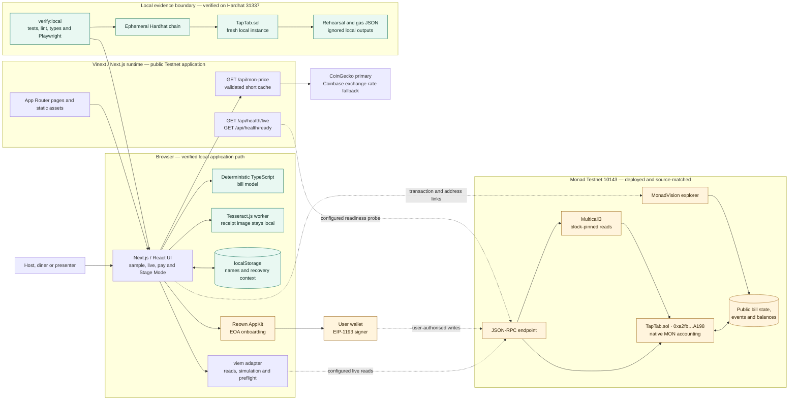

# TapTab architecture

TapTab is a GBP-first shared-bill application. The browser handles receipt
review, the local demonstration, wallet orchestration and presentation; the
`TapTab.sol` contract is authoritative for a live bill’s membership, split,
funding, settlement, proceeds and refunds. There is no application database and
the application never holds a signing key.

This document describes the checked-in implementation and the configured public
application at `https://taptab.mythicmindlabs.workers.dev`. Contract
[`0xa2fb…A198`](https://testnet.monadscan.com/address/0xa2fb0B3bf41B0B50687f4807e8a1ccc346FAA198)
and canonical scaled bill `2` are live on Monad Testnet. Initial bill `1`
remains deployment-time evidence. Deployment, both bill creations and a perfect
Sourcify source match are evidenced below. A subsequent public Testnet
rehearsal completed the real multi-wallet settlement and failure paths on bills
`3` and `4`; its transaction-level record is the
[multi-wallet evidence manifest](monad-testnet-multiwallet-evidence.json).

## System map

Solid arrows are implemented local or external data paths. Dashed arrows are
wallet- or request-dependent live paths. The local Hardhat node deploys a fresh
`TapTab.sol` instance only for each rehearsal; it is not the public Monad
Testnet contract shown above.

## Components and ownership

| Component | Implementation | Owns or controls |
| --- | --- | --- |
| Web interface | `app/TapTabApp.tsx`, `app/TapTabLivePanel.tsx`, `app/pay/` | Presentation state, local sample journey, trusted personal-payment route and Stage Mode |
| Receipt intake | `app/ReceiptImportPanel.tsx`, `app/receipt-image-safety.ts`, `app/taptab-receipt.ts` | Temporary image/OCR state and a host-reviewed receipt draft; images are not uploaded by TapTab |
| Browser persistence | `app/taptab-identity.ts`, `app/taptab-pending-transactions.ts`, `app/taptab-pending-creations.ts` | Bounded, non-authoritative names and recovery records scoped to chain, contract, bill and wallet |
| Price reference | `app/api/mon-price/route.ts` | Process-local validated quote cache with CoinGecko primary, Coinbase exchange-rate fallback, timeout, retry backoff and labelled stale use |
| Operational health | `app/api/health/` and `lib/server/taptab-readiness.ts` | Dependency-free liveness and a fail-closed, five-second configured Testnet readiness probe |
| Wallet and chain adapter | `app/wallet/`, `app/taptab-chain.ts`, `app/taptab-transaction-preflight.ts` | Public configuration, block-pinned reads, call simulation, gas/balance checks and receipt reconciliation |
| Smart contract | `contracts/src/TapTab.sol` | Authoritative bill lifecycle, share owners, split approvals, exact contributions, proceeds and contributor refunds |
| Local evidence | `docs/judging/LOCAL_RUNBOOK.md`, contract rehearsal and gas scripts | Repeatable browser and Solidity evidence on the local build and ephemeral chain 31337 |

The Cloudflare-compatible Worker entry point is `worker/index.ts`; the checked-in
hosting declaration provisions neither D1 nor R2. Public bill state therefore
lives onchain, while optional names and pending-operation recovery remain on one
browser. Clearing browser storage can remove those local labels, but cannot
change a bill or a payment.

## Critical flows

### Local sample

The default sample runs entirely in the browser against the deterministic
TypeScript model. Receipt claims, fair remainder, the median tip, sponsorship,
funding protection, settlement and refund outcomes are simulations and are
labelled as such. The local evidence export intentionally omits chain IDs,
wallets, contract addresses, transaction hashes, explorer links and price
claims.

### Configured live bill

1. The interface accepts only the build-trusted contract
   `0xa2fb0B3bf41B0B50687f4807e8a1ccc346FAA198` and a positive bill ID on Monad
   Testnet chain `10143`. The default public bill is `2`, with deadline
   `2026-08-14T17:01:55Z`.
2. A live snapshot is pinned to one block and read in bounded Multicall3 waves;
   the chain block timestamp, not the device clock, decides expiry.
3. Before a write, the adapter validates context, simulates the exact call,
   estimates gas, applies a buffer and checks wallet balance. The wallet alone
   signs and submits the transaction.
4. The interface waits for a successful receipt, detects wallet replacement,
   persists bounded pending context for refresh recovery and links public hashes
   to MonadVision.
5. `TapTab.sol` prevents overfunding and incomplete settlement. It uses pull
   withdrawals so the venue claims settled proceeds and each original
   contributor claims their own refund after cancellation or expiry.

The server readiness route may also read the configured chain, bytecode and
bill. It does not sign, relay or index transactions.

### Public Monad Testnet rehearsal

The contract at `0xa2fb0B3bf41B0B50687f4807e8a1ccc346FAA198` was exercised
on Monad Testnet chain `10143` with three distinct wallets:

- Bill `3` completed three-wallet participation, deterministic claims,
  unanimous split approval, exact funding, settlement and payee withdrawal. A
  historical call at the partially funded state records the expected
  `BillNotFullyFunded` refusal before settlement became valid.
- Bill `4` completed the two-wallet failure path: both participants contributed,
  the incomplete bill was cancelled and both original contributors claimed
  their refunds.
- The evidence manifest enumerates 31 successful rehearsal transactions. It
  also retains the initial Bob wallet-funding transaction that reverted after
  the RPC estimated only 21,000 gas; the explicit 50,000-gas retry succeeded.
  The failed attempt is reported separately rather than being folded into the
  31-success count.

These are public Testnet transactions, not the ephemeral Hardhat rehearsal and
not a claim that Testnet MON has cash value. See the
[complete JSON evidence](monad-testnet-multiwallet-evidence.json) for actors,
blocks, transaction hashes, events, values and final-state checks.

## Money and trust boundaries

- Receipt values are represented as integer GBP pence. A locked, explicitly
  sourced quote converts the verified rows into integer native-MON wei before
  bill creation.
- `/api/mon-price` reports **mainnet MON** reference values for familiar GBP and
  USD display. It is not an oracle, and displayed Testnet MON value is not a
  redemption promise.
- Bill `2` locks the genuine CoinGecko quote `0.01536012 GBP/MON`. The £48.50
  receipt's unscaled `3157.527415150402471 MON` mainnet-value reference is
  divided by the disclosed `1,000:1` faucet-funded settlement scale, producing
  `3.157527415150402471 Testnet MON`. The metadata records both values and the
  divisor; Testnet MON has no monetary value.
- The contract does not query CoinGecko or Coinbase and does not trust
  browser-calculated funding totals; its own integer accounting controls the
  live lifecycle.
- Wallet addresses, receipt metadata, contribution values and contract events
  can be public. Optional diner names remain local and are not sent in personal
  payment links.
- Reown, the wallet, RPC provider, CoinGecko, Coinbase and explorer are external
  dependencies. Their availability is outside TapTab’s control.

## Verification status

| Path | Status in this workspace |
| --- | --- |
| Production frontend build and local server | Verified locally by the project gate |
| Sample journey at desktop, tablet and mobile widths | Verified locally with Playwright |
| Contract settlement, cancellation, expiry, proceeds and refunds | Verified on ephemeral Hardhat chain `31337` |
| Contract bounds and selected gas regression ceilings | Verified locally; not evidence of public-network acceptance or fees |
| Price-provider and Monad integration code | CoinGecko primary and Coinbase single exchange-rate fallback implemented; availability remains external and environment-dependent |
| Monad Testnet contract deployment | **Confirmed in block `51718885`** — [`0xc48a…a488`](https://testnet.monadscan.com/tx/0xc48ab94b9e503d09f52e32dd8b2f97adb9b0ca80ab83a6a544dc72fa338ba488) |
| Initial bill `1` creation | **Confirmed in block `51718888`** — [`0xf9de…ee41`](https://testnet.monadscan.com/tx/0xf9de7427fd11bdee1d0785c965b7258144f9106ece70d9dfac3b0dcdc943ee41) |
| Canonical bill `2` creation | **Status `1` in block `51722744`; gas `1,612,923`** — [`0xc089…fd70`](https://testnet.monadscan.com/tx/0xc089eb042dc78fb64a0ddf60ea35c5ecbe7f01ff5371b37be9a72bc872effd70) |
| Source verification | **Monadscan source published; MonadVision/Sourcify perfect match** — [verification record](SOURCE_VERIFICATION_STATUS.md) |
| Three-wallet exact funding, settlement and withdrawal | **Confirmed on bill `3`** — creator, Alice and Bob signed the journey; incomplete settlement was refused before exact funding |
| Two-wallet cancellation and contributor refunds | **Confirmed on bill `4`** — Alice and Bob contributed, the bill was cancelled and both original contributors withdrew refunds |
| Public multi-wallet transaction record | **31 successful rehearsal transactions plus one honestly recorded reverted initial Bob funding attempt** — [JSON evidence](monad-testnet-multiwallet-evidence.json) |
| Public Testnet frontend | **Configured for bill `2`** — [live bill](https://taptab.mythicmindlabs.workers.dev/?contract=0xa2fb0B3bf41B0B50687f4807e8a1ccc346FAA198&bill=2#live) and [passing readiness](https://taptab.mythicmindlabs.workers.dev/api/health/ready) |
| Public repository URL | [github.com/MasteraSnackin/taptab](https://github.com/MasteraSnackin/taptab) |

The submission evidence manifest must retain this boundary. The deployment and
bill-creation links above are public Monad evidence, and the separate
[multi-wallet evidence manifest](monad-testnet-multiwallet-evidence.json) is the
canonical record for the 31 successful bill `3`/`4` rehearsal transactions and
the recorded reverted funding attempt. A local address or transaction hash from
Hardhat must never be presented as Testnet evidence. Testnet MON has no monetary
value, and the GBP/USD display is a labelled mainnet MON reference rather than
an oracle or redemption promise.
